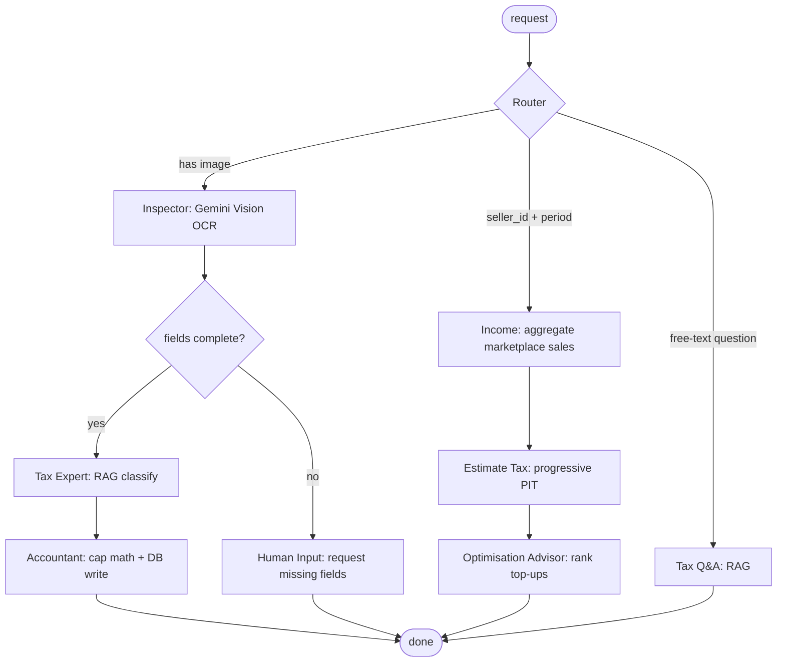

# TicTaxFlow

**An AI-agent tax assistant for Thailand.** Upload a receipt and an agent reads
it, classifies the deduction category, and validates it against the cumulative
legal cap. Sync your marketplace sales and a second agent path estimates the
personal income tax you owe and ranks the deductions that would cut it the most.
Both sides then feed a copy-ready filing pack for the ภ.ง.ด.94 (mid-year) and
ภ.ง.ด.90 (annual) forms.

The differentiator vs. a calculator like iTAX: an agent that *reads and decides*
on **both** sides of the tax equation — expenses and income — rather than a form
you fill in by hand.

> Academic project (SWU Startup Pitching). Not affiliated with, endorsed by, or
> connected to the Thai Revenue Department. Nothing here is filed or transmitted
> to the RD — the filing pack organises figures for you to review and enter into
> RD's own e-Filing site yourself. Tax figures are cited (`backend/SOURCES.md`)
> but must be re-verified against the current RD source before any real use.

---

## Table of contents

- [Features](#features)
- [Architecture](#architecture)
- [Tech stack](#tech-stack)
- [Repository layout](#repository-layout)
- [Prerequisites](#prerequisites)
- [Quick start (local development)](#quick-start-local-development)
- [Running with Docker](#running-with-docker)
- [Configuration](#configuration)
- [The RAG knowledge base](#the-rag-knowledge-base)
- [Testing & CI](#testing--ci)
- [Demo](#demo)
- [Known limitations](#known-limitations)
- [Project documents](#project-documents)

---

## Features

### v1 — the deduction side
- **Upload & extract.** Drop a JPG / PNG / WebP / PDF receipt or e-Tax invoice.
  The Inspector agent (Gemini Vision) pulls out date, amount, vendor tax ID, and
  merchant name. The real MIME type is detected from magic bytes, not trusted
  from the filename.
- **Auto-classify.** The Tax Expert agent uses RAG over the Revenue
  Department's own deduction manuals to classify the receipt (Health/Life
  Insurance, SSF/RMF, donations, Easy E-Receipt, …) and decide deductibility.
- **Validate against cumulative caps.** Deduction limits are enforced
  *cumulatively* per user + category + tax year — the tenth receipt in a
  category is capped against everything already claimed, not in isolation.
- **Dashboard.** Deductions used vs. remaining per category, recent
  transactions, and status breakdown.

### v2 — the income side
- **Multi-platform sales aggregation.** `/income/sync` merges Shopee + Lazada +
  TikTok Shop sales through a real `SalesProvider` adapter interface,
  deduplicating overlapping orders. *(Runs on seeded sample data via
  `Mock*Provider` classes — see [Known limitations](#known-limitations).)*
- **Tax estimation.** A pure, unit-tested function applies the progressive
  8-bracket Thai PIT table to taxable income (gross income minus the Section
  40(8) 60% flat expense deduction), with a flat-vs-actual expense-method
  comparison.
- **Deduction Optimisation Advisor.** Ranks "top up X in category Y → save ≈ Z"
  suggestions by the marginal tax saving at your bracket, using each category's
  remaining headroom.

### Filing pack (ภ.ง.ด.94 / ภ.ง.ด.90)
- Assembles income, the expense-method comparison, deduction headroom, tax due,
  a box-mapping table to real form item numbers, a document checklist, and the
  filing deadline with days remaining (computed, never hardcoded).
- **Preparation aid only** — it never files or submits anything.

---

## Architecture

All agent orchestration runs through a single **LangGraph** compiled once at
startup (`backend/app/services/workflow.py`). Endpoints invoke the compiled
graph; they never chain agents by hand.



- **Auth.** Every data endpoint derives `user_id` from the Supabase JWT via the
  shared dependency in `core/security.py` — `user_id` is never accepted from the
  client. The backend uses the Supabase **service-role** key (bypasses RLS), so
  those explicit `user_id` filters are the tenant boundary.
- **RAG.** Chroma `PersistentClient` at `backend/data/embeddings/`, with an
  explicitly pinned multilingual embedding model (see
  [The RAG knowledge base](#the-rag-knowledge-base)).
- **Data / auth / file storage.** Supabase (Postgres + Auth).

---

## Tech stack

| Layer | Choice |
|---|---|
| Backend | FastAPI, Python 3.11, Uvicorn |
| LLM & Vision | Google Gemini (`google-genai`, model `gemini-2.5-flash`) |
| Agent orchestration | LangGraph (single compiled graph) |
| RAG / vector store | Chroma (`PersistentClient`), `sentence-transformers` `paraphrase-multilingual-MiniLM-L12-v2` |
| Database / Auth / Storage | Supabase (Postgres, GoTrue auth) |
| Frontend | React 19 + TypeScript + Vite + Tailwind CSS v4 |
| Tests | pytest (backend), `tsc` + ESLint (frontend) |

---

## Repository layout

```
backend/
  app/
    agents/        inspector (OCR), tax_expert (RAG classify + Q&A), accountant (DB + cap math)
    services/      workflow.py (LangGraph), retrieval/embeddings (RAG),
                   income_aggregator, tax_estimator, taxable_income, advisor,
                   filing_pack / filing_box_map
    api/v1/endpoints/   auth, profile, receipts, transactions, dashboard,
                        tax_rules, agent, income, filing
    core/          config, security (JWT dependency), tax_constants
    database/      Supabase client
  data/
    documents/     RD source PDFs the RAG index is built from (committed)
    embeddings/    Chroma store (gitignored — rebuilt from documents/)
    fixtures/      seeded marketplace sales + sample receipt images
  scripts/         seed_demo.py, generate_sample_fixtures.py, generate_sample_receipts.py
  tests/           pytest suite
  migrations/      001_income_summary.sql
frontend/
  src/  pages/ · components/ · api/ · lib/ · types/
supabase/
  schema.sql           full schema (run once on a fresh project)
  seed_tax_rules.sql   deduction categories + caps (required — see below)
docs/
  supabase-setup.md
CLAUDE.md · DEMO.md · TicTaxFlow_v2_ROADMAP.md · backend/SOURCES.md
```

---

## Prerequisites

- **Python 3.11**
- **Node.js 20+**
- A **Supabase** project (free tier is fine) — each deployment brings its own;
  no credentials ship with this repo.
- A **Google AI Studio** API key for `gemini-2.5-flash`. The free tier is capped
  at ~20 requests/day/project; each receipt upload costs 2 calls.
- **Internet on first run** to download the embedding model (~500 MB, cached
  afterwards).

---

## Quick start (local development)

```bash
git clone https://github.com/YKUNAKORN/TicTaxFlow.git
cd TicTaxFlow
```

### 1. Supabase

Follow [`docs/supabase-setup.md`](docs/supabase-setup.md). In short:

1. Create a project at <https://supabase.com/dashboard>.
2. **SQL Editor** → run [`supabase/schema.sql`](supabase/schema.sql) (creates
   `users`, `tax_rules`, `transactions`, `income_summary` with RLS).
3. **SQL Editor** → run [`supabase/seed_tax_rules.sql`](supabase/seed_tax_rules.sql).
   **Required** — `tax_rules` starts empty, and until it has rows every
   classified receipt is stored `needs_review` with a 0 deduction and the
   dashboard/advisor show nothing.
4. **Authentication → Providers → Email** → turn **Confirm email** off (so
   newly registered accounts can log in without an email link).
5. **Settings → API** → copy the **Project URL** and the **`service_role`**
   secret key (not the `anon` key — the backend calls the admin API and writes
   rows on the user's behalf).

### 2. Backend

```bash
cd backend

# virtualenv (Python 3.11)
py -3.11 -m venv .venv            # Windows
#  python3.11 -m venv .venv       # macOS/Linux
.\.venv\Scripts\Activate.ps1      # Windows
#  source .venv/bin/activate      # macOS/Linux

pip install -r requirements.txt

# env
cp .env.example .env
#  then edit .env: GEMINI_API_KEY, SUPABASE_URL, SUPABASE_KEY (service role)
```

Build the RAG index (needs internet the first time, for the embedding model):

```bash
python -m app.services.document_indexer
```

Seed a demo user + example transactions. This also builds the RAG index if it
is missing, so you can skip the step above if you run this:

```bash
python scripts/seed_demo.py
#  -> demo@tictaxflow.app / DemoPitch2026!
```

Run it:

```bash
uvicorn main:app --reload --port 8000
#  API on http://localhost:8000  ·  docs at http://localhost:8000/docs
```

### 3. Frontend

```bash
cd frontend
npm install
npm run dev
#  http://localhost:5173  (calls the backend at http://localhost:8000/api/v1, CORS-allowed by default)
```

For a non-localhost backend, set `VITE_API_BASE_URL` before building — Vite
inlines it into the bundle (see [Configuration](#configuration)).

---

## Running with Docker

```bash
# localhost frontend + backend
docker compose up -d --build

# non-local host: make compose read VITE_API_BASE_URL from backend/.env
# (Vite bakes it into the frontend bundle at build time)
docker compose --env-file backend/.env up -d --build
```

Frontend on `:3000`, backend on `:8000`. The backend image runs
`python -m app.services.document_indexer` at **build time**, so the RAG index
and its embedding model are baked into the image — the running container never
needs to reach Hugging Face. `backend/.env` is read from the host at
`docker compose up` time; nothing secret is baked in.

---

## Configuration

`backend/.env` (copy from `backend/.env.example`):

| Variable | Required | Notes |
|---|---|---|
| `GEMINI_API_KEY` | yes | Google AI Studio key for `gemini-2.5-flash`. |
| `SUPABASE_URL` | yes | `https://<ref>.supabase.co` |
| `SUPABASE_KEY` | yes | **`service_role`** secret, not `anon` — bypasses RLS, keep server-side. |
| `CORS_ORIGINS` | no | Comma-separated browser origins allowed to call the API. Default `http://localhost:5173,http://localhost:3000`. Must contain the exact origin the frontend is served from. |
| `VITE_API_BASE_URL` | no (build-time) | Public URL of the backend API **including `/api/v1`**. Vite inlines it at build; set it before `npm run build` / `docker compose build`. Default `http://localhost:8000/api/v1`. |
| `DEBUG_ERRORS` | no | `true` surfaces full exception detail in API error responses. Keep `False` for anything shared. |

The app calls `settings.validate()` at startup and refuses to boot if
`GEMINI_API_KEY` / `SUPABASE_URL` / `SUPABASE_KEY` are missing.

---

## The RAG knowledge base

The Tax Expert agent retrieves context from a **Chroma** vector store at
`backend/data/embeddings/`, built from the Revenue Department PDFs in
`backend/data/documents/` (committed to the repo).

- The store itself is **gitignored** — it is a rebuildable index, not source of
  truth. Build it after cloning:
  ```bash
  cd backend && python -m app.services.document_indexer
  ```
  This needs **no** Gemini or Supabase credentials, but downloads the embedding
  model (~500 MB) from Hugging Face on the first run and caches it.
- The embedding function is **pinned** to
  `sentence-transformers/paraphrase-multilingual-MiniLM-L12-v2`
  (`backend/app/services/embeddings.py`) — multilingual, so it handles Thai —
  **not** Chroma's English-only default. Indexing and querying import it from
  the same place; if you ever change `EMBEDDING_MODEL_NAME`, delete
  `backend/data/embeddings/` and re-run the indexer, or index and query land in
  different vector spaces and retrieval silently returns nonsense.
- `scripts/seed_demo.py` rebuilds the index automatically if it is empty.

---

## Testing & CI

```bash
# backend
cd backend && pytest

# frontend
cd frontend
npm run lint
npm run typecheck        # tsc -b, no emit
npm run build            # tsc -b && vite build
```

The backend tests never touch real Gemini or Supabase — `tests/conftest.py`
sets dummy credentials and every external call is stubbed. GitHub Actions
(`.github/workflows/ci.yml`) runs `pytest` and the frontend lint + build on
every PR to `main`.

---

## Demo

[`DEMO.md`](DEMO.md) is the shot-by-shot recording script for the pitch: the
one-time setup (RAG index, `tax_rules` seed, Gemini quota), the demo user state
after seeding, and the 8 shots with the exact figures each one should show. The
seeded marketplace fixtures are regenerated per tax year with
`python scripts/generate_sample_fixtures.py`.

---

## Known limitations

Stated plainly here and in `DEMO.md` — these are honest engineering gaps, not
things to paper over in the pitch.

- **Marketplace sync is seeded sample data.** `MockShopeeProvider` /
  `MockLazadaProvider` / `MockTikTokShopProvider` read fixtures through a real
  `SalesProvider` adapter interface. Live Shopee/Lazada/TikTok Shop OAuth is a
  v3 item.
- **Tax figures need verification.** Bracket rates and constants are cited in
  `backend/SOURCES.md`; per-category `max_limit`s in `supabase/seed_tax_rules.sql`
  mirror the classifier's own prompt. Re-verify against <https://rd.go.th>
  before any non-demo use. Read limits from the `tax_rules` table, never
  hardcode them.
- **Personal allowances are not modelled.** The tax estimate applies the 60%
  flat expense deduction but not the fixed personal/spouse/child allowances, so
  it slightly *overstates* tax. The filing pack approximates "allowances" as the
  sum of used receipt-backed deduction categories (halved for ภ.ง.ด.94).
- **Donation categories are not capped at 10% of net income.** The
  amount-based / 2× path has no statutory ceiling in scope; it is logged as a
  known gap.
- **AI-classified receipts auto-verify.** A receipt mapped to a concrete
  category with `is_deductible: true` is stored `verified` and counts toward the
  deduction total immediately, with no human review step.

---

## Project documents

| File | What it is |
|---|---|
| [`CLAUDE.md`](CLAUDE.md) | Persistent context + architecture rules for AI-assisted work on this repo. |
| [`DEMO.md`](DEMO.md) | Recorded-pitch setup and 8-shot script. |
| [`TicTaxFlow_v2_ROADMAP.md`](TicTaxFlow_v2_ROADMAP.md) | The v1→v2 plan and what shipped in each phase. |
| [`backend/SOURCES.md`](backend/SOURCES.md) | Every tax constant with its RD source URL + retrieval date. |
| [`docs/supabase-setup.md`](docs/supabase-setup.md) | Step-by-step Supabase project setup. |
